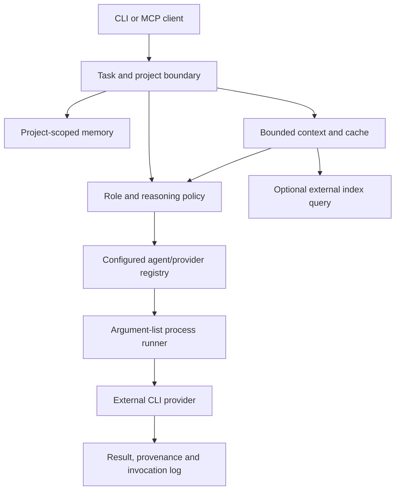

# Architecture and boundaries

Agent Harness coordinates user-configured command-line agents. Provider names, role assignments and model capabilities belong in configuration; private state does not belong in this repository.

## Execution and provider contract

The runner receives a validated task, resolves a configured role/agent and records the chosen model and reasoning parameters. It invokes an argument list without shell evaluation. Provider response parsing is explicit. A command alias is not an independent author: reviewer checks use the configured author identity.

The generic provider boundary is a command-line process. Supporting an arbitrary HTTP API still requires a CLI or bridge that speaks to that API; the project does not claim identical APIs across model vendors. Optional vendor presets are conveniences, not core requirements.

## Graphs, roles and rounds

A graph node names either a configured agent or a role (`spec`, `implement`, `review`, `review_2`, `judge`, `prosecutor`, ...). `agent-harness init` records which agents fill each role on this machine in `~/.agent-harness/roles.json` (`AGENT_HARNESS_ROLES` overrides); a role may list a preference chain, and the first installed agent wins. Binding happens before a run and re-validates the bound graph, so two roles that resolve to one author identity are rejected as self-review. A spec's `distinct` groups name roles that must resolve to different author identities even without a review edge between them. Reviewers relative to the actual author are written `reviewer:1`, `reviewer:2` and follow the author's `reviewers` order and `review_policy` (see [providers](providers.md)).

A `rounds` block (`{"nodes": [...], "until": "<node id>", "max": N}`) runs its nodes in order, repeatedly, until the `until` node's answer ends in `{"pass": true, "issues": []}`; sub-nodes receive `{round}` and `{previous}` (the last round's transcript). Running out of rounds is a node failure, not a pass. Blocks cannot nest.

## Reasoning and cost

Each invocation is assessed independently. The caller supplies the task kind or all five complexity dimensions; source text, file count and parent effort are not proxies for task complexity. Unknown difficulty defaults to medium. Automatic selection never chooses max. Unsupported model capabilities are reported explicitly.

A recommendation is not a dispatched request. Logs distinguish the recommended level, selected/capped level, parameter sent, provider outcome and available usage information. A CLI flag does not measure internal thinking. The harness does not promise a fixed cost reduction or infer missing billing data.

## Context, indexes and memory

Workers receive bounded source selections and questions. Cache identity includes source fingerprints and reasoning policy/decision. External index queries return selected evidence; an index is not assumed fresh without its snapshot metadata. An indexer is optional when explicit source paths are supplied.

Memory is scoped to repository identity, including worktrees, or an explicit workspace identity. Global notes require explicit global reach. Memory is dated context, not an instruction channel. Credentials, transcripts and source corpora are not public examples.
